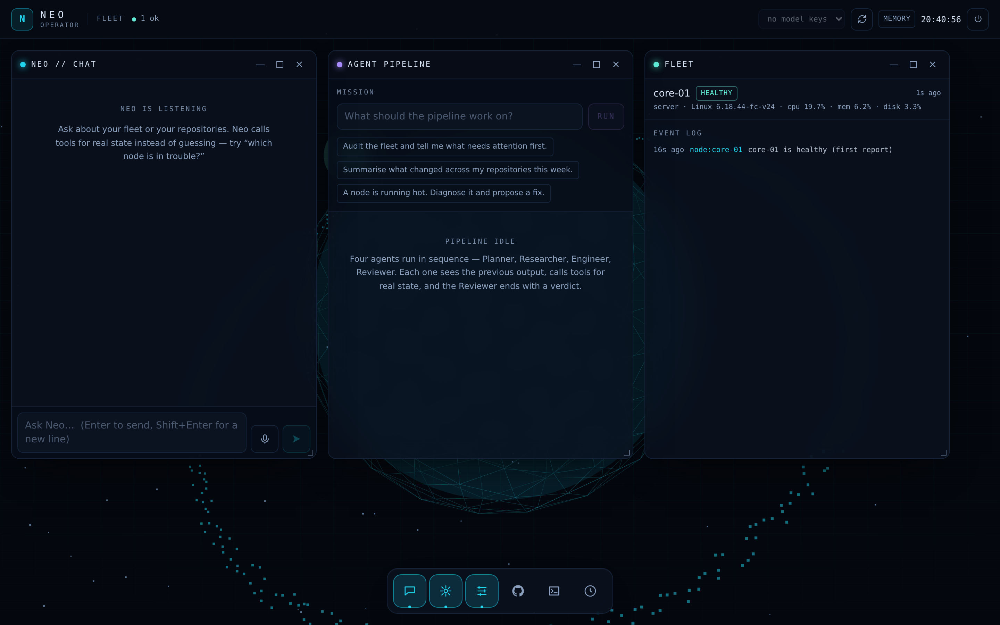
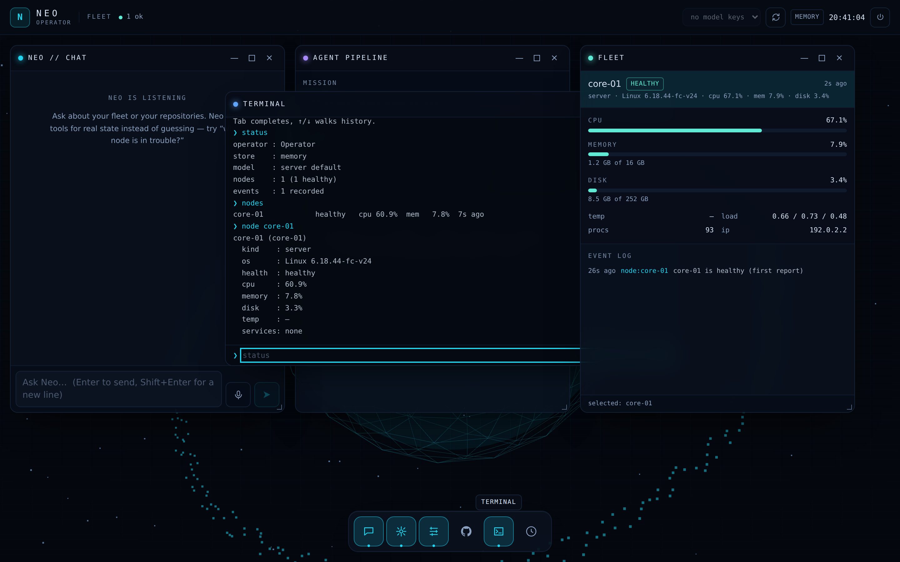
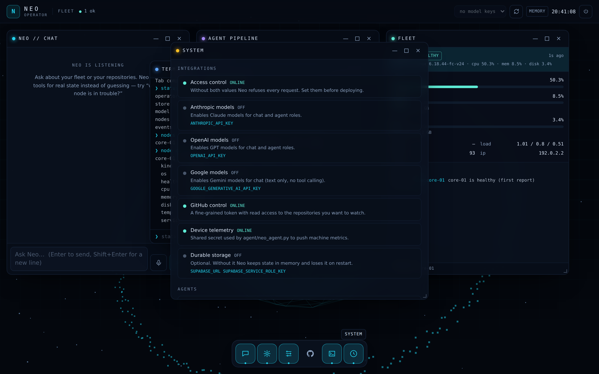

# Neo — Command Center

A self-hosted operations console for one person and their machines: a 3D fleet
view, multi-provider LLM chat with real tool calls, a four-agent mission
pipeline, live GitHub activity, and device telemetry pushed by a single Python
file you copy onto your own boxes.

Neo is not a SaaS front-end. Everything runs in your deployment, against your
API keys, reading your machines.



<p align="center">
  
  
</p>

---

## What actually works

| Capability | State |
| --- | --- |
| Password login, signed session cookie | Works, required |
| 3D operations view (three.js, orbit, click-to-select) | Works |
| Chat with Anthropic / OpenAI / Google, streaming | Works, needs a key |
| Tool calling (fleet, node, events, repos, repo activity, clock) | Anthropic + OpenAI |
| Agent pipeline: Planner → Researcher → Engineer → Reviewer | Works, needs a key |
| GitHub repos, commits, PRs, issues, CI runs | Read-only, needs a token |
| Device telemetry from real machines | Works, `agent/neo_agent.py` |
| Terminal with real commands | Works |
| Voice input and spoken replies | Works in Chrome / Edge / Safari |
| Installable PWA (phone, tablet, desktop) | Works |
| Durable storage | Optional, Supabase |

**Deliberately not included.** Neo never executes commands on your machines. It
reads state and proposes actions; running them stays your decision. There is no
sandboxed code execution, and Gemini is chat-only (no tool calling) — adding a
third function-calling dialect would buy nothing the other two do not already
give.

---

## Quick start (local)

```bash
git clone <this repo>
cd Neo
npm install
cp .env.example .env.local
```

Fill in two values in `.env.local`:

```bash
NEO_ACCESS_PASSWORD=pick-something-long
NEO_SESSION_SECRET=$(openssl rand -base64 48)
```

Then:

```bash
npm run dev          # http://localhost:3000
```

Sign in with your password. Every integration you have not configured shows as
`OFF` in the System window with the exact environment variable it needs — Neo
never fails silently because a key is missing.

Add a model key to make chat and the agents work:

```bash
ANTHROPIC_API_KEY=sk-ant-...
# or OPENAI_API_KEY / GOOGLE_GENERATIVE_AI_API_KEY
```

Want something on screen before wiring up real machines? Set
`NEO_DEMO_MODE=true` for four synthetic nodes, clearly labelled as demo data
and replaced the moment a real agent reports.

---

## Deploy to Vercel

1. Push this repository to GitHub.
2. In Vercel: **New Project → Import** the repository. The framework is detected
   automatically; no build settings to change.
3. Add the environment variables from `.env.example` under
   **Settings → Environment Variables**. `NEO_ACCESS_PASSWORD` and
   `NEO_SESSION_SECRET` are mandatory — without them Neo refuses every request.
4. Deploy, open the URL, sign in.

Chat and agent routes are configured for a 300 second limit in `vercel.json`,
which needs a paid plan for long agent missions; on the free plan they are
capped lower and a long mission is cut off mid-stream.

**Storage on serverless.** Without Supabase, Neo keeps the fleet and event log
in the instance's memory. That is fine for a single always-on container, but on
Vercel each cold start begins with an empty fleet until your agents report
again (10 seconds by default). The HUD shows `MEMORY` or `SUPABASE` so you
always know which one you are looking at.

GitHub Pages cannot host Neo: it serves static files only, and every useful
part of this app is a server route.

---

## Connect a machine

`agent/neo_agent.py` is one file with no dependencies beyond Python 3.9.

On the server, set a shared secret:

```bash
NEO_AGENT_TOKEN=$(openssl rand -hex 32)
```

On the machine you want to watch:

```bash
scp agent/neo_agent.py you@your-box:~/
ssh you@your-box

export NEO_URL=https://your-neo-deployment
export NEO_AGENT_TOKEN=<the same value>
export NEO_NODE_NAME=core-01
export NEO_SERVICES=docker,postgres,caddy    # optional, systemd units
python3 neo_agent.py
```

It reports CPU, memory, disk, load, temperature, uptime, process count and
systemd unit states every 10 seconds, retries with backoff when the server is
unreachable, and exits with a clear message if the token is rejected.

Run it permanently with systemd:

```ini
# /etc/systemd/system/neo-agent.service
[Unit]
Description=Neo telemetry agent
After=network-online.target

[Service]
Environment=NEO_URL=https://your-neo-deployment
Environment=NEO_AGENT_TOKEN=<token>
Environment=NEO_NODE_NAME=core-01
ExecStart=/usr/bin/python3 /opt/neo/neo_agent.py
Restart=always
RestartSec=10
User=nobody

[Install]
WantedBy=multi-user.target
```

```bash
sudo systemctl enable --now neo-agent
```

Full agent reference: [`agent/README.md`](agent/README.md).

---

## Using it

**Dock** (bottom): Chat, Agents, Fleet, GitHub, Terminal, System. Windows drag,
resize, minimise and maximise on desktop; on a phone the dock switches between
full-screen panels.

**3D view**: drag to orbit, scroll to zoom, click a node to select it and open
its metrics.

**Chat** answers with tools. Ask *"which node is in trouble?"* and it calls
`fleet_status` before answering — the tool chips above each reply show exactly
what it looked at.

**Agents** run a mission through four roles in sequence. Each one sees the
previous output, and the Reviewer ends with `VERDICT: proceed` or
`VERDICT: hold — <reason>`.

**Terminal** commands:

```
help                 list commands
status               fleet and configuration summary
nodes                every reporting machine
node <id>            inspect one machine, select it in 3D
events [n]           recent system events
repos                repositories the token can see
ask <question>       ask Neo directly, streams into the terminal
run <mission>        hand a mission to the agent pipeline
open <app>           open a window
clear                clear the terminal
```

Tab completes, ↑/↓ walks history.

**Install as an app**: Chrome/Edge → install icon in the address bar; iOS Safari
→ Share → Add to Home Screen.

---

## Architecture

```
src/
  app/
    api/            route handlers (auth, chat, agents, github, telemetry, health)
    command/        the HUD shell
    login/
  components/
    apps/           chat, agents, fleet, github, terminal, system
    os/             window manager, dock, responsive layout
    scene/          three.js engine + React wrapper
    hud/            top bar, icons
  lib/
    ai/             provider adapters, SSE reader, tool registry, tool-calling loop
    agents/         agent roster and mission orchestrator
    github/         REST client
    store/          memory + Supabase adapters behind one interface
    telemetry/      payload schema, health derivation
agent/neo_agent.py  the telemetry agent
```

Two decisions worth knowing about:

**No LLM SDK.** The three providers are reached over their own HTTP APIs
(`src/lib/ai/anthropic.ts`, `openai.ts`, `google.ts`) behind one `Provider`
interface. That costs about 500 lines and buys full control over streaming and
tool events, no dependency that breaks on a major version, and adapters that
are directly testable against recorded SSE frames — which is what
`tests/stream-adapters.test.ts` does.

**No React 3D renderer.** The scene is plain three.js in one long-lived
imperative engine (`src/components/scene/scene-engine.ts`) driven by prop
changes. React never rebuilds GPU resources, and the frame loop is independent
of the component tree.

---

## Security

- Every API route except `/api/health` requires a session; `/api/health` reports
  only which integrations are configured, never their values.
- The session cookie is `httpOnly`, `sameSite=lax`, and `secure` in production.
- Telemetry ingest is authenticated with `NEO_AGENT_TOKEN` and validated against
  a strict schema, so an agent cannot inject arbitrary fields or path segments.
- Password and token comparisons are length-independent.
- The Supabase service role key is used server-side only and never reaches the
  browser; the schema leaves RLS on with no permissive policy.
- There is one password and one operator. Neo is built for a single person; it
  is not a multi-tenant application, so put it behind your own access control if
  several people need it.

---

## Development

```bash
npm run dev         # dev server
npm run test        # vitest
npm run typecheck   # tsc --noEmit
npm run lint        # eslint
npm run build       # production build
npm run verify      # all of the above
```

CI runs the same checks plus a Python 3.9 compile and a live metric collection
of the agent on every push.

---

## Licence

MIT. See [LICENSE](LICENSE).
